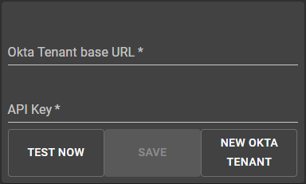
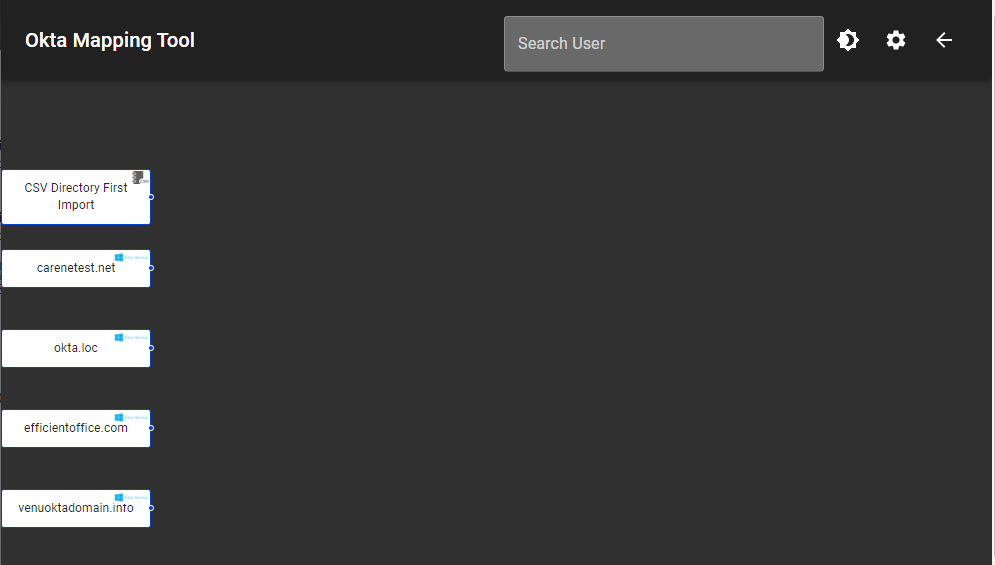

## Okta profile browser

Electron based app to help browse Okta universal directory mappings and profiles.

Start the project

> yarn start

Commands for building the executable file

> yarn run build

> yarn run build-installer

Steps for using the Mapping application-

1.         Enter your base URL and API key and click 'TEST NOW' button for validation.
        Click on 'SAVE' once the entered fields are valid.

        

2.         Profile sources will be displayed after validating and saving the credentials.
        click on any displayed profile source for obtaining the general user mapping.

        

3.         All the applications in Okta will be displayed on the right side of the screen.
        Now click on any of the application to get the complete mapping.

        

4.         You can now select any user who is either assigned to profile source or Okta from the
        search bar above to get the mapping and apps assigned of the selected user.

5.         Click on assigned apps on the right side of the screen to get the attribute names
        given to user for that particualar application.
